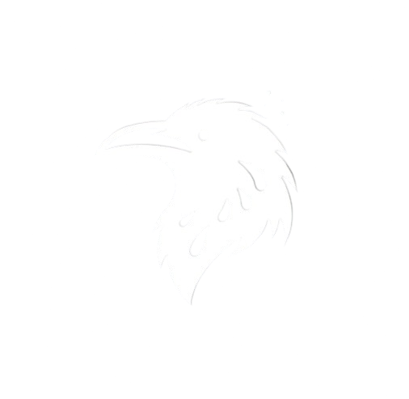

  
   
  <strong>Tocka Nest</strong>
   
  <em>Die Krähe Lebt</em>

---

## 🌟 Sobre Nós

Tocka Nest é uma iniciativa dedicada a promover soluções de código aberto 🌐, especialmente voltada para beneficiar empresas brasileiras 🇧🇷 que não possuem os recursos para desenvolver sistemas internos proprietários.

Nossa missão é compartilhar o código-fonte completo para vários sistemas internos em desenvolvimento 📦, oferecendo uma alternativa aos produtos comerciais caros que nem sempre entregam qualidade 💸. Entendemos os desafios enfrentados pelas empresas neste espaço, pois já os vivenciamos em primeira mão. Nossas ofertas incluem:

- [🔢 Sistemas de Pontos](#)
- [💰 Sistema de Caixa](#)
- [📄 Sistema de Emissão de NFE e CFE](#)
- [👥 Aplicativos Para Gerenciamento de Funcionários](#)

Embora busquemos a perfeição, reconhecemos nossas limitações e abraçamos a jornada de melhoria contínua 🔄, assim como qualquer entidade dedicada ao ethos de código aberto. É importante notar que nem todos os nossos projetos serão de código aberto; uma lista de projetos proprietários pode ser encontrada em [Não é Open Source](#not-open-source).

---

## ❌ Não é Open Source

- [Nosso site.](https://tockanest.com)
- Nossa API interna do site.
